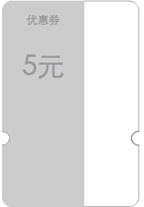

# v-coupon 一款基于 vue 的卡券组件

### 介绍

你是否在心里暗骂设计师设计出这种有缺口的卡券？

你是否试了多种 CSS 方案都无法完美实现？

你是否在为不得不用 jpg/png...等格式而内心挣扎？

v-coupon 就是为了解决以上痛点而诞生的。

先看看效果




> 如果上图你有看到白色背景，那不是 bug, 是我截图的时候页面的背景就是白色的

### 使用

1. 安装

```
npm i v-coupon
```

2. 在你的 vue 入口文件注册

```javascript
import coupon from 'v-coupon'
Vue.use(coupon)
```
3. 在需要展示卡券的页面使用
```html
<v-coupon config="yourConfig">
  <div class="content">
    你要展示的内容
  </div>
</v-coupon>
```


当然,你也许不需要全局引入，可以直接在需要使用的页面注册 `v-coupon/src/coupon.vue` 组件

```javascript
import vCoupon from 'v-coupon/src/coupon.vue'

// ...省略其他无关代码

components: {
    'v-coupon': vCoupon
}

```
### 详细说明

1. `<v-coupon>...</v-coupon>` 之间包含的内容,是一个 slot, 这意味这 v-coupon 只提供一个**裁切模版**,其他内容你可以任意定制，给予你最大的发挥空间,但同时为了避免各种复杂的问题,只能有一个slot, 以下代码的第二个 div 不会被显示出来

```html
<v-coupon config="yourConfig">
  <div class="content">
    第一个 div 的内容，会正常显示
  </div>

  <div>
    第二个 div 的内容，不会显示出来
  </div>
</v-coupon>
```

2. 配置, 上例的 `yourConfig` 就是我们要传给 v-coupon 的配置，具体的配置项如下
```javascript
{
    width: 200, // 卡券宽度
    height: 300, // 卡券高度
    borderRadius: 15, // 卡券四个角的圆角半径
    borderColor: '#33cc44', // 边框颜色
    borderWidth: 0.5, // 边框粗细
    borderOpcity: 1, // 边框透明度
    borderDash: null, // 边框虚线数组, 直线是 null, 虚线的话给一个数组,如[2,2]
    showLine: true, // 是否显示分割线
    lineColor: '#33cc44', // 分割线颜色
    lineWidth: 0.4, // 分割线粗细
    lineOpcity: 1, // 分割线透明度
    lineDash: [3, 5], // 分割线虚线数组, 同 边框虚线数组
    lineOffset: 5, // 分割线跟卡券两侧的距离, 为 0 则相连
    cutPosition: 200, // 裁切口的位置
    cutRadius: 10, // 裁切口的半径
    cutSlope: 1.5, // 裁切口的弧度
    background: '#ffffff' // 背景颜色, 优先级低于 slot 的背景
}
```

> 以上单位, 除了裁切口弧度 `cutSlope` 外，其他**数值的单位**均为 px, 暂未对其他单位做支持.


> 上面的配置的值, 其实就是 v-coupon 的默认值, 采用 `Object.assign` 的方式合并**用户配置**跟**默认值**, 也就是说, 你不必传所有的配置，没有传的会采用默认值

边框虚线数组 和 分割线虚线数组 有不明白的, 可以参考 [MDN:SGV的stroke-dasharray属性](https://developer.mozilla.org/zh-CN/docs/Web/SVG/Attribute/stroke-dasharray)

### 兼容

v-coupon 的核心内容是 `SVG 的 foreignObject`, 具体的兼容请参考 [Can I Use](https://caniuse.com/#search=foreignObject)


### 其他

有任何 bug, 需求, 意见, 建议, 吐槽, 欢迎走 issue 通道, 同时也欢迎 pr.
